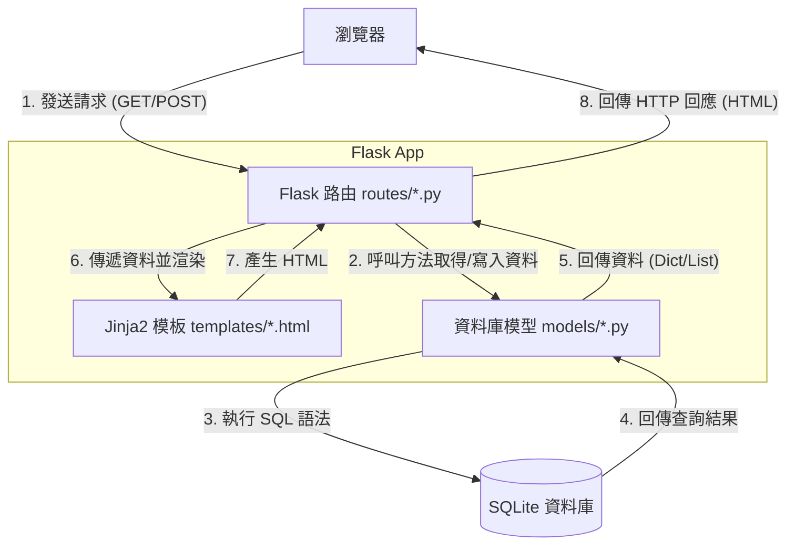

# 系統架構設計 (ARCHITECTURE)

## 1. 技術架構說明

本專案採用 Python + Flask 作為後端框架，不採用前後端分離，由後端直接使用 Jinja2 渲染 HTML 頁面返回給瀏覽器。這是一種傳統的 MVC (Model-View-Controller) 或 MTV (Model-Template-View) 架構，適合需要快速開發且符合課堂規範的專案。

- **選用技術與原因**：
  - **後端：Python + Flask**。Flask 是一個輕量級框架，易於理解與學習，非常適合初學者與中小型專案。
  - **模板引擎：Jinja2**。內建於 Flask，可直接將後端資料注入 HTML 模板，快速產生動態頁面，不需額外學習前端框架。
  - **資料庫：SQLite**。輕量化、免安裝伺服器，資料庫就是一個檔案 (`database.db`)，非常方便移植與備份。
  - **前端：HTML/CSS/JavaScript + Bootstrap 5**。不使用前端框架，單純使用原生網頁技術與 Bootstrap 達成響應式設計 (RWD)，符合課堂規範且開發快速。

- **Flask 架構模式說明**：
  - **Model (資料模型)**：負責與 SQLite 資料庫溝通，執行 CRUD 操作。
  - **View (視圖/模板)**：即 `templates/` 目錄下的 Jinja2 HTML 檔案，負責將資料格式化並顯示給使用者。
  - **Controller (控制器/路由)**：即 `routes/` 目錄下的 Python 檔案，負責接收瀏覽器的請求，呼叫對應的 Model 取得資料，再將資料傳給 View 進行渲染。

## 2. 專案資料夾結構

本專案採用模組化的結構，將不同職責的程式碼分開放置：

```text
rent_app/
├── app/                        # 應用程式主目錄
│   ├── __init__.py             # Flask app 建立與初始化
│   ├── models/                 # 資料庫模型 (Model)
│   │   ├── __init__.py
│   │   ├── user_model.py       # 使用者 (學生/房東) 相關資料庫操作
│   │   ├── property_model.py   # 房源相關資料庫操作
│   │   ├── review_model.py     # 評論與評分相關操作
│   │   └── roommate_model.py   # 徵室友貼文相關操作
│   ├── routes/                 # Flask 路由 (Controller)
│   │   ├── __init__.py
│   │   ├── auth_routes.py      # 註冊/登入/身分驗證路由
│   │   ├── property_routes.py  # 房源搜尋/刊登/管理路由
│   │   ├── review_routes.py    # 評論與評分路由
│   │   └── roommate_routes.py  # 徵室友區路由
│   ├── templates/              # Jinja2 HTML 模板 (View)
│   │   ├── base.html           # 全站共用基礎模板 (含導覽列、頁尾)
│   │   ├── auth/               # 登入、註冊相關頁面
│   │   ├── property/           # 房源列表、詳情、刊登頁面
│   │   ├── review/             # 評論頁面
│   │   └── roommate/           # 徵室友列表、發文頁面
│   └── static/                 # 靜態資源檔案
│       ├── css/                # 自訂樣式表
│       ├── js/                 # 自訂 JavaScript
│       └── images/             # 圖片資源
├── instance/                   # 存放應用程式運行時產生的檔案
│   └── database.db             # SQLite 資料庫檔案
├── database/                   # 資料庫相關腳本
│   └── schema.sql              # 資料庫初始化建表 SQL 語法
├── docs/                       # 專案設計文件 (PRD, 架構等)
├── .env.example                # 環境變數範例檔
├── requirements.txt            # Python 依賴套件清單
└── app.py                      # 應用程式入口，啟動 Flask 伺服器
```

## 3. 元件關係圖



## 4. 關鍵設計決策

1. **使用 Blueprint 組織路由**：將路由依照功能拆分到不同的 Python 檔案中，避免單一檔案過於龐大，並有利於團隊分工開發。
2. **輕量化資料庫存取**：採用 `sqlite3.Row` 封裝查詢結果，讓開發者可以用類似字典的方式 `row['column_name']` 存取欄位，取代複雜的 ORM (如 SQLAlchemy)，降低初學者的學習門檻。
3. **統一的基礎模板 (base.html)**：使用 Jinja2 的模板繼承機制，將共用元件統一放置，確保全站 UI 風格一致。
4. **環境變數與敏感資訊隔離**：使用 `.env` 檔案管理密鑰，並將其加入 `.gitignore`，確保專案安全性。
