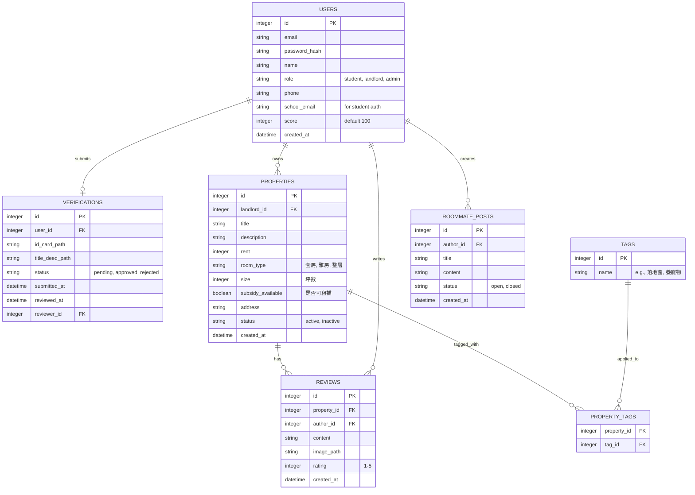

# 資料庫設計 (DB Schema)

**專案名稱**：逢甲租屋網 (Feng Chia Rental Platform)

本文件依據 PRD 所定義的功能需求，規劃 SQLite 資料表的結構與關聯。

---

## 1. ER 圖（實體關係圖）

---

## 2. 資料表詳細說明

### 2.1 USERS (使用者表)
儲存所有平台使用者，包含學生、房東與系統管理員。
- `id` (INTEGER): Primary Key, 自動遞增。
- `email` (TEXT): 登入帳號，必填，唯一。
- `password_hash` (TEXT): 密碼雜湊值，必填。
- `name` (TEXT): 顯示名稱，必填。
- `role` (TEXT): 身分，允許值：`student`, `landlord`, `admin`。
- `phone` (TEXT): 聯絡電話。
- `school_email` (TEXT): 逢甲信箱，用於 F-06 揪團找室友功能驗證。
- `score` (INTEGER): 信用積分，預設為 100。低於 80 限制權限 (F-07)。
- `created_at` (DATETIME): 建立時間。

### 2.2 VERIFICATIONS (身分驗證表)
用於 F-04 房東身分驗證，記錄上傳的證明文件與審核狀態。
- `id` (INTEGER): Primary Key。
- `user_id` (INTEGER): 申請的房東 ID (Foreign Key -> USERS.id)。
- `id_card_path` (TEXT): 身分證影本的檔案路徑，必填。
- `title_deed_path` (TEXT): 權狀影本的檔案路徑，必填。
- `status` (TEXT): 審核狀態，允許值：`pending`, `approved`, `rejected`。
- `submitted_at` (DATETIME): 提交時間。
- `reviewed_at` (DATETIME): 審核完成時間。
- `reviewer_id` (INTEGER): 審核的管理員 ID (Foreign Key -> USERS.id)。

### 2.3 PROPERTIES (房源表)
儲存房東刊登的租屋資訊。
- `id` (INTEGER): Primary Key。
- `landlord_id` (INTEGER): 房東 ID (Foreign Key -> USERS.id)。
- `title` (TEXT): 房源標題，必填。
- `description` (TEXT): 詳細說明。
- `rent` (INTEGER): 每月租金，必填。
- `room_type` (TEXT): 房型，如「獨立套房」、「分租套房」、「雅房」、「整層住家」。
- `size` (INTEGER): 坪數。
- `subsidy_available` (BOOLEAN): 是否可申請租金補貼。
- `address` (TEXT): 房屋地址。
- `status` (TEXT): 狀態，如 `active` (刊登上架中), `inactive` (已下架)。
- `created_at` (DATETIME): 建立時間。

### 2.4 TAGS (標籤表)
用於 F-02 關鍵字標籤搜尋。
- `id` (INTEGER): Primary Key。
- `name` (TEXT): 標籤名稱（如：落地窗、採光好、養寵物），必填，唯一。

### 2.5 PROPERTY_TAGS (房源與標籤關聯表)
紀錄房源具備哪些標籤（多對多關係）。
- `property_id` (INTEGER): Foreign Key -> PROPERTIES.id。
- `tag_id` (INTEGER): Foreign Key -> TAGS.id。
- Primary Key (property_id, tag_id)。

### 2.6 REVIEWS (評論表)
用於 F-03 學生匿名上傳實際圖片與賞屋評論。
- `id` (INTEGER): Primary Key。
- `property_id` (INTEGER): 評論的房源 ID (Foreign Key -> PROPERTIES.id)。
- `author_id` (INTEGER): 留言者 ID (Foreign Key -> USERS.id)。
- `content` (TEXT): 評論內容。
- `image_path` (TEXT): 實際圖片的檔案路徑。
- `rating` (INTEGER): 評分 (1-5 顆星)。
- `created_at` (DATETIME): 建立時間。

### 2.7 ROOMMATE_POSTS (徵室友文章表)
用於 F-06 揪團找室友區。
- `id` (INTEGER): Primary Key。
- `author_id` (INTEGER): 發文者 ID (Foreign Key -> USERS.id)。
- `title` (TEXT): 文章標題，必填。
- `content` (TEXT): 文章內容，必填。
- `status` (TEXT): 狀態，允許值：`open` (徵求中), `closed` (已找到)。
- `created_at` (DATETIME): 建立時間。
