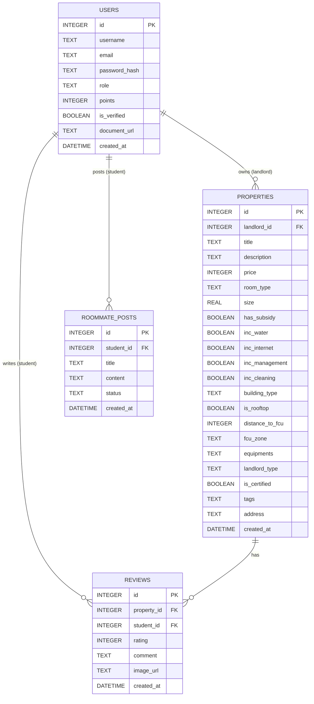

# 資料庫設計 (DB DESIGN)

## 1. ER 圖 (實體關係圖)

## 2. 資料表詳細說明

### 2.1 USERS (使用者表)
儲存學生與房東的帳號資料，並包含信用積分與身分驗證狀態。
- `id` (INTEGER): 主鍵，自動遞增。
- `username` (TEXT): 顯示名稱。
- `email` (TEXT): 電子郵件 (學生用於認證逢甲信箱)。
- `password_hash` (TEXT): 加密後的密碼。
- `role` (TEXT): 角色，'student' 或 'landlord'。
- `points` (INTEGER): 雙向信用評分積分 (預設 100)。
- `is_verified` (BOOLEAN): 是否通過身分驗證 (房東需審核)。
- `document_url` (TEXT): 房東上傳的證明文件路徑 (審核用)。
- `created_at` (DATETIME): 帳號建立時間。

### 2.2 PROPERTIES (房源表)
儲存房東刊登的房源資訊。
- `id` (INTEGER): 主鍵，自動遞增。
- `landlord_id` (INTEGER): 外鍵，對應 USERS.id。
- `title` (TEXT): 房源標題。
- `description` (TEXT): 房源詳細說明。
- `price` (INTEGER): 每月租金。
- `room_type` (TEXT): 房型 (如：雅房、分租套房、獨立套房)。
- `size` (REAL): 坪數。
- `has_subsidy` (BOOLEAN): 是否可申請租屋補助。
- `inc_water` (BOOLEAN): 是否包水費。
- `inc_internet` (BOOLEAN): 是否包網路費。
- `inc_management` (BOOLEAN): 是否包管理費。
- `inc_cleaning` (BOOLEAN): 是否包清潔費。
- `building_type` (TEXT): 建物類型 (電梯大樓, 公寓, 透天厝)。
- `is_rooftop` (BOOLEAN): 是否為頂樓加蓋。
- `distance_to_fcu` (INTEGER): 距離逢甲步行時間(分鐘)。
- `fcu_zone` (TEXT): 鄰近區域 (正門, 側門, 商圈, 僑光, 水湳)。
- `equipments` (TEXT): 設備清單 (如：冷氣,冰箱,垃圾代收,對外窗)。
- `landlord_type` (TEXT): 房東類型 (房東直租, 代管公司)。
- `is_certified` (BOOLEAN): 是否已認證權狀。
- `tags` (TEXT): 逗號分隔的標籤 (如：養寵物,乾濕分離)。
- `address` (TEXT): 房屋地址 (供地圖功能使用)。
- `created_at` (DATETIME): 刊登時間。

### 2.3 REVIEWS (評論表)
學生對房源的賞屋心得或真實評論 (可匿名上傳)。
- `id` (INTEGER): 主鍵，自動遞增。
- `property_id` (INTEGER): 外鍵，對應 PROPERTIES.id。
- `student_id` (INTEGER): 外鍵，對應 USERS.id。
- `rating` (INTEGER): 評分 (1-5 顆星)。
- `comment` (TEXT): 評論內容。
- `image_url` (TEXT): 實際圖片路徑 (選填)。
- `created_at` (DATETIME): 評論時間。

### 2.4 ROOMMATE_POSTS (徵室友表)
逢甲信箱認證學生專屬的徵室友佈告欄。
- `id` (INTEGER): 主鍵，自動遞增。
- `student_id` (INTEGER): 外鍵，對應 USERS.id。
- `title` (TEXT): 貼文標題。
- `content` (TEXT): 尋找室友的詳細條件與說明。
- `status` (TEXT): 狀態 ('open' 或 'closed')。
- `created_at` (DATETIME): 發文時間。
